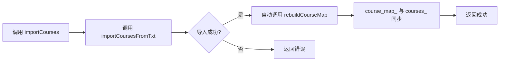
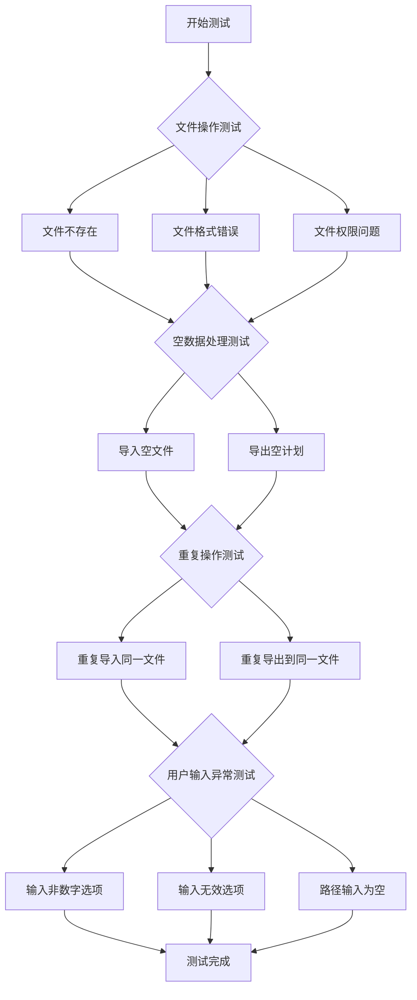

# 1. 问题

当前排课系统使用三个全局变量（`courses`、`course_map`、`plan`）来管理程序状态，导致状态管理不清晰，数据流向难以追踪，测试和扩展都存在障碍。

## 1.1. **全局状态管理混乱**

`src/main.cpp` 文件的第 10-12 行定义了三个全局变量：

```cpp
std::vector<Course> courses; // 全局变量，存储导入的课程目录
std::unordered_map<std::string, Course> course_map; // 全局变量，存储课程 ID 到课程对象的映射
std::vector<SemesterPlan> plan; // 全局变量，存储生成的排课计划
```

这些全局变量在程序的多个地方被直接访问和修改：

- 第 68-70 行：导入课程时直接修改全局 `courses` 和 `course_map`
- 第 92-102 行：导出计划时直接读取和修改全局 `courses` 和 `plan`
- 第 111 行：导出时直接使用全局 `plan` 和 `course_map`

**为什么这是问题**：

- **数据流向不清晰**：任何函数都可能修改这些全局状态，无法追踪状态的变化路径
- **难以测试**：全局状态在测试用例之间共享，容易产生相互干扰，难以编写独立的单元测试
- **扩展性差**：未来如果需要支持多个课程目录或多个排课方案，全局变量会成为障碍

## 1.2. **职责分散且耦合**

当前代码中，`rebuildCourseMap` 函数（第 28-33 行）需要手动维护 `course_map` 与 `courses` 的一致性：

```cpp
void rebuildCourseMap(const std::vector<Course>&courses, std::unordered_map<std::string, Course>& course_map){
    course_map.clear(); // 清空旧映射
    for (const auto& c : courses) {
        course_map[c.id] = c; // 用课程 ID 作为键，课程对象作为值
    }
}
```

这个函数在导入课程后被调用（第 69 行），但维护两个数据结构一致性的责任分散在多处，容易出错。

**为什么这是问题**：

- **维护成本高**：每次修改 `courses` 后都需要记得调用 `rebuildCourseMap`，容易遗漏
- **职责不明确**：数据一致性的维护责任分散，没有统一的管理入口
- **容易产生不一致**：如果忘记调用重建函数，`course_map` 可能与 `courses` 不同步

# 2. 收益

通过将全局状态封装到类中，可以显著提升代码的可维护性、可测试性和扩展性。

## 2.1. **清晰的数据流向**

将状态封装到类后，所有对状态的访问和修改都通过类的接口进行，数据流向一目了然。

- **减少隐式依赖**：函数不再依赖全局变量，依赖关系通过参数和类成员显式表达
- **易于追踪状态变化**：所有状态修改都经过类的方法，可以在方法中添加日志或断言
- **降低理解成本**：新开发者可以快速理解状态的管理方式，不需要在多个文件中查找全局变量的使用

## 2.2. **提升可测试性**

封装后的状态管理使得编写单元测试变得简单。

- **独立的测试环境**：每个测试用例可以创建独立的类实例，互不干扰
- **易于模拟**：可以通过依赖注入或继承来模拟状态管理行为
- **测试覆盖率提高**：原本难以测试的全局状态逻辑现在可以通过测试类的公共方法来验证

## 2.3. **增强扩展性**

封装后的架构为未来的功能扩展提供了良好的基础。

- **支持多实例**：可以轻松创建多个课程系统实例，支持多个课程目录或排课方案
- **易于添加新功能**：新的状态和操作可以直接添加到类中，不需要修改全局代码
- **便于重构**：类的内部实现可以独立重构，不影响外部调用者

# 3. 方案

引入一个 `CourseSystem` 类来封装全局状态，将全局变量转换为类的成员变量，并通过类的公共接口管理状态。

## 3.1. **封装状态管理：解决"全局状态管理混乱"**

### 核心思路

创建一个 `CourseSystem` 类，将 `courses`、`course_map`、`plan` 作为私有成员变量，并提供导入、导出、生成计划等公共方法。

### 实现步骤

1. 创建 `CourseSystem` 类，将三个全局变量作为私有成员
2. 将 `rebuildCourseMap` 改为私有方法，在内部自动维护一致性
3. 提供导入课程、导出计划、生成计划等公共方法
4. 在 `main` 函数中创建 `CourseSystem` 实例，通过实例调用方法

### 修改前的代码

```cpp
// src/main.cpp

// 全局变量
std::vector<Course> courses;
std::unordered_map<std::string, Course> course_map;
std::vector<SemesterPlan> plan;

void rebuildCourseMap(const std::vector<Course>&courses, std::unordered_map<std::string, Course>& course_map){
    course_map.clear();
    for (const auto& c : courses) {
        course_map[c.id] = c;
    }
}

int main(){
    // ...
    case 1: // 导入课程目录
    {
        std::string path;
        std::string err;
        std::cout<<"请输入课程文件路径(回车默认 data/courses.txt):";
        std::cin.ignore(std::numeric_limits<std::streamsize>::max(),'\n');
        std::getline(std::cin, path);
        if (path.empty()) {
            path = "data/courses.txt";
        }
        if(importCoursesFromTxt(path,courses,err)){
            rebuildCourseMap(courses,course_map); // 手动维护一致性
            std::cout<<"导入课程目录成功，共导入 "<<courses.size()<<" 门课程\n";
        }else{
            std::cout<<"导入课程目录失败: "<<err<<"\n";
        }
        break;
    }
    // ...
}
```

### 修改后的代码

```cpp
// include/course_system.h

#ifndef COURSE_SYSTEM_H
#define COURSE_SYSTEM_H

#include <string>
#include <vector>
#include <unordered_map>
#include "models.h"

class CourseSystem {
public:
    CourseSystem() = default;
    
    // 导入课程目录
    bool importCourses(const std::string& path, std::string& error_message);
    
    // 导出排课计划
    bool exportPlan(const std::string& path, std::string& error_message);
    
    // 生成排课计划
    bool generatePlan(std::string& error_message);
    
    // 获取课程数量
    size_t getCourseCount() const { return courses_.size(); }
    
    // 检查是否有课程
    bool hasCourses() const { return !courses_.empty(); }
    
    // 检查是否有排课计划
    bool hasPlan() const { return !plan_.empty(); }

private:
    // 重建课程映射（私有方法，内部自动调用）
    void rebuildCourseMap();
    
    // 私有成员变量
    std::vector<Course> courses_;
    std::unordered_map<std::string, Course> course_map_;
    std::vector<SemesterPlan> plan_;
};

#endif // COURSE_SYSTEM_H
```

```cpp
// src/course_system.cpp

#include "course_system.h"
#include "course_io.h"
#include <iostream>

bool CourseSystem::importCourses(const std::string& path, std::string& error_message) {
    if (importCoursesFromTxt(path, courses_, error_message)) {
        rebuildCourseMap(); // 自动维护一致性
        return true;
    }
    return false;
}

bool CourseSystem::exportPlan(const std::string& path, std::string& error_message) {
    if (!hasCourses()) {
        error_message = "请先导入课程目录";
        return false;
    }
    
    // 如果没有计划，生成临时占位计划
    if (!hasPlan()) {
        SemesterPlan s;
        for (const auto& c : courses_) {
            s.course_ids.push_back(c.id);
            s.total_credits += c.credit;
        }
        plan_.push_back(s);
    }
    
    return exportPlanToTxt(path, plan_, course_map_, error_message);
}

bool CourseSystem::generatePlan(std::string& error_message) {
    if (!hasCourses()) {
        error_message = "请先导入课程目录";
        return false;
    }
    
    // TODO: 实现真正的排课算法
    // 这里暂时使用临时占位逻辑
    SemesterPlan s;
    for (const auto& c : courses_) {
        s.course_ids.push_back(c.id);
        s.total_credits += c.credit;
    }
    plan_.clear();
    plan_.push_back(s);
    
    return true;
}

void CourseSystem::rebuildCourseMap() {
    course_map_.clear();
    for (const auto& c : courses_) {
        course_map_[c.id] = c;
    }
}
```

```cpp
// src/main.cpp

#include <iostream>
#include <limits>
#include "course_system.h"

void printMenu() {
    std::cout << "\n=== 排课系统主菜单(TUI) ===\n";
    std::cout << "1. 导入课程目录\n";
    std::cout << "2. 编辑课程目录\n";
    std::cout << "3. 生成排课计划\n";
    std::cout << "4. 导出排课计划\n";
    std::cout << "0. 退出程序\n";
    std::cout << "输入序号: ";
}

int main() {
    CourseSystem system; // 创建系统实例
    int choice = -1;
    
    while (true) {
        printMenu();
        
        if (!(std::cin >> choice)) {
            std::cout << "输入错误，请输入序号: ";
            std::cin.clear();
            std::cin.ignore(std::numeric_limits<std::streamsize>::max(), '\n');
            continue;
        }
        
        switch (choice) {
            case 1: {
                std::string path;
                std::string err;
                
                std::cout << "请输入课程文件路径(回车默认 data/courses.txt):";
                std::cin.ignore(std::numeric_limits<std::streamsize>::max(), '\n');
                std::getline(std::cin, path);
                if (path.empty()) {
                    path = "data/courses.txt";
                }
                
                if (system.importCourses(path, err)) {
                    std::cout << "导入课程目录成功，共导入 " << system.getCourseCount() << " 门课程\n";
                } else {
                    std::cout << "导入课程目录失败: " << err << "\n";
                }
                break;
            }
            
            case 2: {
                std::cout << "编辑课程目录\n";
                break;
            }
            
            case 3: {
                std::string err;
                if (system.generatePlan(err)) {
                    std::cout << "生成排课计划成功\n";
                } else {
                    std::cout << "生成排课计划失败: " << err << "\n";
                }
                break;
            }
            
            case 4: {
                std::string path;
                std::string err;
                
                std::cout << "请输入导出文件路径(回车默认 output/plan.txt):";
                std::cin.ignore(std::numeric_limits<std::streamsize>::max(), '\n');
                std::getline(std::cin, path);
                if (path.empty()) {
                    path = "output/plan.txt";
                }
                
                if (system.exportPlan(path, err)) {
                    std::cout << "导出排课计划成功:" << path << "\n";
                } else {
                    std::cout << "导出排课计划失败: " << err << "\n";
                }
                break;
            }
            
            case 0:
                std::cout << "退出程序\n";
                return 0;
                
            default:
                std::cout << "无效选项，请重新输入序号: ";
                break;
        }
    }
    
    return 0;
}
```

### 架构对比

```mermaid
classDiagram
    class "当前架构" as Current {
        +courses: vector~Course~
        +course_map: unordered_map
        +plan: vector~SemesterPlan~
        +rebuildCourseMap()
        +main()
    }
    
    class "重构后架构" as Refactored {
        -courses_: vector~Course~
        -course_map_: unordered_map
        -plan_: vector~SemesterPlan~
        +importCourses()
        +exportPlan()
        +generatePlan()
        -rebuildCourseMap()
    }
    
    class "main函数" as Main {
        +system: CourseSystem
    }
    
    Current --> Current : 全局变量直接访问
    Refactored --> Refactored : 私有成员封装
    Main --> Refactored : 通过实例调用
```

这个图展示了重构前后的架构变化：

- **当前架构**：全局变量直接暴露，任何函数都可以访问和修改
- **重构后架构**：状态被封装在 `CourseSystem` 类中，通过公共接口访问
- **main 函数**：创建 `CourseSystem` 实例，通过实例调用方法

## 3.2. **自动维护数据一致性：解决"职责分散且耦合"**

### 核心思路

将 `rebuildCourseMap` 改为私有方法，在 `importCourses` 方法中自动调用，确保 `course_map_` 始终与 `courses_` 保持一致。

### 实现步骤

1. 将 `rebuildCourseMap` 改为 `CourseSystem` 的私有方法
2. 在 `importCourses` 方法中，成功导入课程后自动调用 `rebuildCourseMap`
3. 移除外部对 `rebuildCourseMap` 的调用

### 修改前的代码

```cpp
// main.cpp
void rebuildCourseMap(const std::vector<Course>&courses, std::unordered_map<std::string, Course>& course_map){
    course_map.clear();
    for (const auto& c : courses) {
        course_map[c.id] = c;
    }
}

// 调用处
if(importCoursesFromTxt(path,courses,err)){
    rebuildCourseMap(courses,course_map); // 需要手动调用
    std::cout<<"导入课程目录成功，共导入 "<<courses.size()<<" 门课程\n";
}
```

### 修改后的代码

```cpp
// course_system.cpp
void CourseSystem::rebuildCourseMap() {
    course_map_.clear();
    for (const auto& c : courses_) {
        course_map_[c.id] = c;
    }
}

bool CourseSystem::importCourses(const std::string& path, std::string& error_message) {
    if (importCoursesFromTxt(path, courses_, error_message)) {
        rebuildCourseMap(); // 自动调用，无需手动维护
        return true;
    }
    return false;
}
```

### 数据一致性维护流程



这个流程图展示了数据一致性维护的自动化过程：

- **自动维护**：在导入课程成功后，自动调用 `rebuildCourseMap`，确保 `course_map_` 与 `courses_` 同步
- **无需手动调用**：外部调用者不需要关心数据一致性的维护细节
- **减少错误**：避免了忘记调用 `rebuildCourseMap` 导致的数据不一致问题

# 4. 回归范围

本次重构主要涉及代码结构的调整，不改变业务逻辑，需要重点测试以下场景。

## 4.1. 主链路

### 导入课程目录流程

1. 用户选择"导入课程目录"选项
2. 输入课程文件路径（或使用默认路径）
3. 系统读取文件并解析课程信息
4. 系统自动维护课程映射表
5. 显示导入成功的课程数量

**关键检查点**：

- 导入成功后，课程数量显示正确
- 课程映射表与课程列表保持一致
- 可以正常导出排课计划

### 导出排课计划流程

1. 用户选择"导出排课计划"选项
2. 如果没有课程，提示用户先导入课程
3. 如果没有排课计划，自动生成临时占位计划
4. 输入导出文件路径（或使用默认路径）
5. 系统将排课计划写入文件

**关键检查点**：

- 未导入课程时，正确提示用户
- 导出的文件格式正确，包含课程名称和学分信息
- 导出路径正确，文件可以正常打开

### 生成排课计划流程

1. 用户选择"生成排课计划"选项
2. 如果没有课程，提示用户先导入课程
3. 系统根据课程信息生成排课计划
4. 显示生成成功提示

**关键检查点**：

- 未导入课程时，正确提示用户
- 生成的排课计划包含所有课程
- 可以正常导出生成的排课计划

## 4.2. 边界情况

### 文件操作异常

- **文件不存在**：输入不存在的文件路径，系统应正确提示错误信息
- **文件格式错误**：课程文件格式不正确，系统应正确解析错误并提示
- **文件权限问题**：导出路径没有写入权限，系统应正确提示错误

### 空数据处理

- **导入空文件**：课程文件为空，系统应正确处理并显示导入 0 门课程
- **导出空计划**：没有生成排课计划时导出，系统应自动生成临时占位计划

### 重复操作

- **重复导入同一文件**：多次导入同一课程文件，系统应正确覆盖原有数据
- **重复导出到同一文件**：多次导出到同一文件，文件内容应正确更新

### 用户输入异常

- **输入非数字选项**：在菜单中输入非数字字符，系统应正确提示并重新显示菜单
- **输入无效选项**：输入超出菜单范围的数字，系统应正确提示并重新显示菜单
- **路径输入为空**：在文件路径输入时直接回车，系统应使用默认路径

### 边界情况测试流程



这个流程图展示了边界情况的测试顺序：

- **文件操作测试**：验证系统对各种文件异常情况的处理能力
- **空数据处理测试**：验证系统对空数据的正确处理
- **重复操作测试**：验证系统对重复操作的兼容性
- **用户输入异常测试**：验证系统对异常用户输入的处理能力
